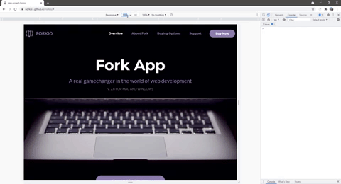

# Project-Forkio
## Here I have shown a responsive layout.
__________________________
**Technologies used**:
- HTML and CSS
- SCSS
- JavaScript
- Gulp:
    - browser-sync
    - del
    - gulp-autoprefixer
    - gulp-clean-css
    - gulp-concat
    - gulp-imagemin
    - gulp-purgecss
    - gulp-rename
    - gulp-sass
    - gulp-uglify
- JQuery
- Figma

    
    

---

- **javascript for burger menu**

    

---

- **media queries in css for responsive layout**

    

